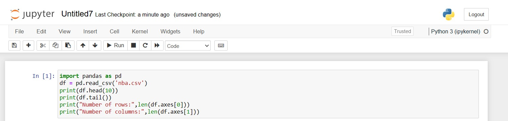

# Read-from-CSV

## AIM:
To write a python program for reading content from a CSV file
## ALGORITHM:
### Step 1:
import pandas as pd
### Step 2:
Read the  CSV file using read_csv method
### Step 3:
Use heead and tail method to get the required contents from the file
### Step 4:
Use len() method to get the required contents from the file.
### Step 5:
Display the result.
## PROGRAM:
'''
Developed by: Guttha KEERTHANA
Register No: 212223240045
'''
To write a python program for reading content from a CSV file.
import pandas as pd
df = pd.read_csv('nba.csv')
print(df.head(10))
print(df.tail())
print("Number of rows:",len(df.axes[0]))
print("Number of columns:",len(df.axes[1]))
## OUTPUT:

## RESULT:
Thus python program for reading content from a CSV file is successful.
